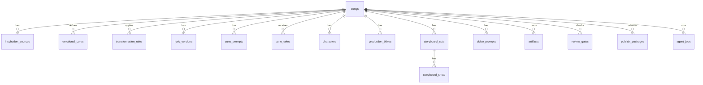

# ReVersion 웹앱 DB 모델

## 0. 설계 원칙

DB는 가사를 대신 쓰는 곳이 아니다. DB는 `무엇이 어디까지 왔는지`, `어떤 산출물이 어떤 결정에서 나왔는지`, `왜 승인 또는 보류됐는지`를 추적한다.

Markdown은 사람이 읽는 최종 문서이고, DB는 운영과 검색을 위한 상태 레이어다.

## 1. 핵심 엔티티



## 2. 테이블 목록

| 테이블 | 용도 |
|---|---|
| `songs` | 곡 단위 마스터 레코드 |
| `inspiration_sources` | 참조곡/IP/장르/감정 원천 |
| `emotional_cores` | 화자, 상대, 사건, 핵심 감정 |
| `transformation_rules` | 번안/답가/팬픽OST/오리지널 변환축 |
| `genre_blueprints` | BPM, 중심 장르, 보조 질감, 편곡 곡선 |
| `chorus_hooks` | 후렴 후보, 제목, 썸네일 문구 |
| `lyric_versions` | 가사 버전과 승인 상태 |
| `suno_prompts` | Suno Custom Mode paste pack |
| `suno_takes` | 생성본, 평가, 선택 로그 |
| `characters` | 화자/캐릭터/상대/소품 시트 |
| `production_bibles` | 곡별 complete bible 문서 |
| `storyboard_cuts` | CUT 단위 15초 블록 |
| `storyboard_shots` | 각 CUT 내부 SHOT |
| `image_prompts` | 캐릭터/스토리보드 이미지 프롬프트 |
| `video_prompts` | Morphic/Seedance/Veo용 비디오 프롬프트 |
| `video_clips` | 생성된 mp4 클립과 품질 상태 |
| `edit_timelines` | 편집 싱크, 음악/영상 길이, 렌더 상태 |
| `review_gates` | 승인/조건부 승인/보류 판단 |
| `publish_packages` | 제목, 설명, 태그, 고정댓글 |
| `publish_metrics` | 발행 후 성과 |
| `agent_profiles` | 전문가/스킬 정의 |
| `model_profiles` | 작업별 모델 선택 |
| `agent_jobs` | 에이전트 실행 기록 |
| `artifacts` | 모든 파일 경로와 계보 |
| `audit_events` | 누가 언제 무엇을 바꿨는지 |

## 3. 상태 Enum

곡 상태:

```text
draft
intake
motif_review
lyrics
suno
character
production_bible
video_assets
safety_review
publish_ready
released
archived
blocked
```

산출물 상태:

```text
not_started
planned
in_progress
candidate
approved
rejected
ready_for_generation
generated
needs_revision
released
archived
```

승인 상태:

```text
pending
in_review
approved
conditional
blocked
overridden
```

## 4. SQLite P0 스키마 초안

```sql
CREATE TABLE songs (
  id TEXT PRIMARY KEY,
  type TEXT NOT NULL,
  title TEXT NOT NULL,
  public_title TEXT,
  target_format TEXT NOT NULL,
  status TEXT NOT NULL DEFAULT 'draft',
  current_phase TEXT NOT NULL DEFAULT 'intake',
  emotional_thesis TEXT,
  main_genre TEXT,
  duration_sec INTEGER,
  bible_path TEXT,
  created_at TEXT NOT NULL,
  updated_at TEXT NOT NULL
);

CREATE TABLE inspiration_sources (
  id TEXT PRIMARY KEY,
  song_id TEXT NOT NULL REFERENCES songs(id),
  source_type TEXT NOT NULL,
  display_name TEXT NOT NULL,
  use_allowed TEXT NOT NULL,
  copy_risk TEXT NOT NULL,
  notes TEXT
);

CREATE TABLE emotional_cores (
  id TEXT PRIMARY KEY,
  song_id TEXT NOT NULL REFERENCES songs(id),
  speaker TEXT NOT NULL,
  target TEXT,
  event TEXT,
  surface_emotion TEXT,
  true_emotion TEXT,
  unsaid_sentence TEXT,
  chorus_sentence TEXT,
  approved INTEGER NOT NULL DEFAULT 0
);

CREATE TABLE transformation_rules (
  id TEXT PRIMARY KEY,
  song_id TEXT NOT NULL REFERENCES songs(id),
  main_axis TEXT NOT NULL,
  support_axis TEXT,
  keep_emotion TEXT,
  change_surface TEXT,
  forbidden_elements TEXT,
  one_line_concept TEXT
);

CREATE TABLE lyric_versions (
  id TEXT PRIMARY KEY,
  song_id TEXT NOT NULL REFERENCES songs(id),
  version_label TEXT NOT NULL,
  lyrics_path TEXT NOT NULL,
  fixed_chorus TEXT,
  status TEXT NOT NULL,
  review_notes TEXT,
  created_at TEXT NOT NULL
);

CREATE TABLE suno_prompts (
  id TEXT PRIMARY KEY,
  song_id TEXT NOT NULL REFERENCES songs(id),
  title TEXT,
  style_of_music TEXT NOT NULL,
  lyrics_text TEXT NOT NULL,
  negative_prompt TEXT,
  settings_json TEXT,
  status TEXT NOT NULL
);

CREATE TABLE suno_takes (
  id TEXT PRIMARY KEY,
  song_id TEXT NOT NULL REFERENCES songs(id),
  prompt_id TEXT REFERENCES suno_prompts(id),
  file_path TEXT,
  take_label TEXT,
  chorus_score REAL,
  vocal_score REAL,
  originality_score REAL,
  selected INTEGER NOT NULL DEFAULT 0,
  notes TEXT
);

CREATE TABLE characters (
  id TEXT PRIMARY KEY,
  song_id TEXT NOT NULL REFERENCES songs(id),
  role TEXT NOT NULL,
  code_name TEXT NOT NULL,
  emotional_function TEXT,
  visual_anchor TEXT,
  voice_anchor TEXT,
  props_json TEXT,
  forbidden_json TEXT,
  sheet_path TEXT,
  status TEXT NOT NULL
);

CREATE TABLE production_bibles (
  id TEXT PRIMARY KEY,
  song_id TEXT NOT NULL REFERENCES songs(id),
  version_label TEXT NOT NULL,
  doc_path TEXT NOT NULL,
  cut_count INTEGER,
  duration_sec INTEGER,
  status TEXT NOT NULL,
  created_at TEXT NOT NULL
);

CREATE TABLE storyboard_cuts (
  id TEXT PRIMARY KEY,
  song_id TEXT NOT NULL REFERENCES songs(id),
  bible_id TEXT REFERENCES production_bibles(id),
  cut_number INTEGER NOT NULL,
  cut_code TEXT NOT NULL,
  time_start REAL NOT NULL,
  time_end REAL NOT NULL,
  title_kr TEXT,
  title_en TEXT,
  director_intent TEXT,
  transition_note TEXT,
  status TEXT NOT NULL
);

CREATE TABLE storyboard_shots (
  id TEXT PRIMARY KEY,
  cut_id TEXT NOT NULL REFERENCES storyboard_cuts(id),
  shot_number INTEGER NOT NULL,
  time_start REAL NOT NULL,
  time_end REAL NOT NULL,
  start_frame TEXT,
  end_frame TEXT,
  camera TEXT,
  action TEXT,
  sfx TEXT,
  music_sync TEXT
);

CREATE TABLE prompts (
  id TEXT PRIMARY KEY,
  song_id TEXT NOT NULL REFERENCES songs(id),
  cut_id TEXT REFERENCES storyboard_cuts(id),
  prompt_type TEXT NOT NULL,
  engine TEXT NOT NULL,
  body TEXT NOT NULL,
  negative_prompt TEXT,
  status TEXT NOT NULL
);

CREATE TABLE artifacts (
  id TEXT PRIMARY KEY,
  song_id TEXT REFERENCES songs(id),
  cut_id TEXT REFERENCES storyboard_cuts(id),
  artifact_type TEXT NOT NULL,
  path TEXT NOT NULL,
  engine TEXT,
  source_prompt_id TEXT REFERENCES prompts(id),
  status TEXT NOT NULL,
  created_at TEXT NOT NULL
);

CREATE TABLE review_gates (
  id TEXT PRIMARY KEY,
  song_id TEXT NOT NULL REFERENCES songs(id),
  gate_name TEXT NOT NULL,
  score_json TEXT,
  verdict TEXT NOT NULL,
  reviewer TEXT,
  notes TEXT,
  reviewed_at TEXT NOT NULL
);

CREATE TABLE agent_jobs (
  id TEXT PRIMARY KEY,
  song_id TEXT REFERENCES songs(id),
  agent_name TEXT NOT NULL,
  model_profile_id TEXT,
  input_summary TEXT,
  output_path TEXT,
  status TEXT NOT NULL,
  created_at TEXT NOT NULL,
  completed_at TEXT
);
```

## 5. Manifest 매핑

곡별 manifest는 DB의 가벼운 스냅샷이다.

```yaml
song:
  id: RV-KR-001
  type: adaptation
  title: 새벽 세 시의 고백
  status: production_bible
  current_phase: character
documents:
  intake: 03. 제작/번안형/01. 새벽 세 시의 고백/01. 오케스트라 인테이크.md
  lyrics: 03. 제작/번안형/01. 새벽 세 시의 고백/05. 가사 디렉터 에이전트.md
  suno: 03. 제작/번안형/01. 새벽 세 시의 고백/06. Suno 최종 프롬프트 패키지.md
  bible: null
assets:
  audio_takes: []
  character_sheets: []
  storyboard_sheets: []
  video_clips: []
gates:
  song_quality: pending
  safety: pending
  production_bible: pending
next_actions:
  - 화자 시트 확정
  - 9 CUT storyboard 작성
```

## 6. DB 승인 기준

P0에서 DB에 반드시 들어가야 하는 것:

- 곡 ID와 현재 단계
- 승인된 후렴 첫 줄
- 현재 Suno prompt 버전
- 캐릭터/화자 시트 상태
- Production Bible 상태
- 안전 리뷰 판정
- 최종 발행 패키지 경로

나중에 넣어도 되는 것:

- 세부 가사 라인별 타임코드
- 모든 이미지 생성 비용
- 모든 모델 호출 토큰/비용
- 플랫폼별 성과 세부 지표

## 7. 강제 보류 조건

DB 레벨에서 아래 조건은 `blocked`로 남긴다.

- 참조곡 가사 또는 멜로디 직접 사용
- 공식 IP 캐릭터명/외형 복제
- Suno prompt에 특정 실존 아티스트 모사 지시
- 캐릭터 시트 없이 스토리보드 생성 진행
- 안전 리뷰 없이 발행 패키지 승인
