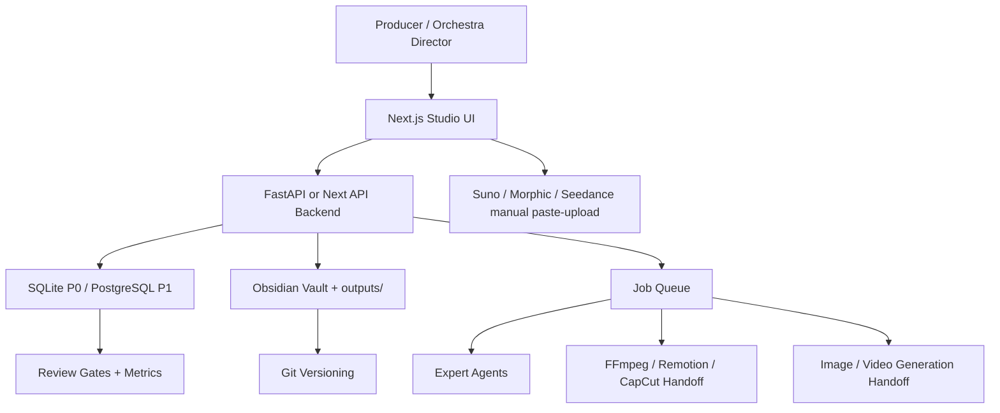

# ReVersion 웹앱 시스템 아키텍처

## 0. 결론

아직 Re:Version Music에는 웹 화면, 시스템 아키텍처, DB, UX/UI 설계가 반영되어 있지 않았다.

이 문서부터 Re:Version은 Obsidian 볼트만이 아니라 `곡별 제작 오케스트라 웹앱`으로 확장한다. 레퍼런스는 `storm-credit/oddengine`이며, 그대로 복제하지 않고 Re:Version의 노래 우선 파이프라인에 맞게 변환한다.

핵심 정의:

```text
ReVersion Studio = 좋은 곡을 끝까지 완성시키는 롱폼 MV 제작 운영실
```

## 1. OddEngine에서 가져올 것

oddengine에서 가져올 구조:

| OddEngine 문법 | Re:Version 변환 |
|---|---|
| MV-first studio | Song-first longform studio |
| 1 track = 1 workspace | 1 song = 1 production cockpit |
| manifest / registry 기반 | song manifest + production bible 기반 |
| phase gate | 오케스트라 승인 게이트 |
| prompt board | Suno / 이미지 / 비디오 프롬프트 보드 |
| characters / objects / lights | 화자 / 상대 / 반복 소품 / 조명 |
| outputs 폴더와 API 미리보기 | Obsidian 문서 + 산출물 미리보기 |
| 외부 API 없는 도구는 복사/업로드 | Suno, Morphic, Seedance는 paste pack + 업로드 |

가져오지 않을 것:

- 짧은 숏폼 중심 구조
- 세계관/영상이 노래보다 앞서는 구조
- 참조곡/IP를 공개 브랜딩처럼 쓰는 구조
- 생성 버튼만 많은 도구형 화면

## 2. 제품 원칙

1. 좋은 노래가 1순위다.
2. 모든 곡은 하나의 workspace에서 끝까지 추적된다.
3. 캐릭터/화자 시트와 스토리보드는 곡별 프로덕션 바이블의 일부다.
4. Suno 생성물, 이미지, 비디오, 편집본은 모두 원본 파일과 연결된다.
5. 외부 서비스 자동화가 위험하거나 불안정하면 복사/업로드 워크플로우로 둔다.
6. 저작권/브랜드 안전 게이트는 생성 버튼보다 먼저 보인다.
7. DB는 상태와 관계를 추적하고, Markdown은 제작자가 읽는 최종 문서를 보존한다.

## 3. 전체 아키텍처



## 4. 레이어별 설계

### Frontend

권장 스택:

```text
Next.js + React + TypeScript
```

핵심 역할:

- 곡 목록과 진행 상태 보기
- 곡별 오케스트라 cockpit
- 화자/캐릭터 시트 미리보기
- Suno paste pack 복사
- 스토리보드 CUT 표 미리보기
- 비디오 프롬프트 복사와 생성본 업로드
- 승인 게이트와 보류 사유 표시
- 발행 패키지 작성

필수 라우트:

| Route | 화면 |
|---|---|
| `/` | Dashboard |
| `/songs` | Song List |
| `/songs/new` | New Song Intake |
| `/songs/{id}` | Song Workspace |
| `/songs/{id}/orchestra` | Deep Orchestra Board |
| `/songs/{id}/lyrics` | Lyrics + Hook Editor |
| `/songs/{id}/suno` | Suno Producer Desk |
| `/songs/{id}/characters` | Character / Speaker Sheet |
| `/songs/{id}/storyboard` | Storyboard Sheet Board |
| `/songs/{id}/video` | Video Prompt + Clip Board |
| `/songs/{id}/review` | Safety + Approval Matrix |
| `/songs/{id}/publish` | Upload Package |
| `/settings` | Models, folders, integrations |

### Backend

권장 스택:

```text
P0: FastAPI local backend
P1: FastAPI + worker queue
P2: hosted API + PostgreSQL
```

서비스 분리:

| Service | 책임 |
|---|---|
| `song_service` | 곡 생성, 상태 변경, manifest 관리 |
| `orchestra_service` | 전문가 배정, 승인 판단, 회의록 생성 |
| `motif_service` | 참조곡/장르 모티브 분석 기록 |
| `lyrics_service` | 후렴, 가사 버전, 번역, 수정 라운드 |
| `suno_service` | Suno prompt pack, take log, 선택 기준 |
| `character_service` | 화자/캐릭터 시트와 reference assets |
| `bible_service` | Complete Production Bible 생성/갱신 |
| `storyboard_service` | CUT/SHOT/프롬프트 파싱과 미리보기 |
| `asset_service` | 이미지, mp3, mp4, docx/pdf 산출물 경로 |
| `review_service` | 저작권/브랜드/품질 게이트 |
| `publish_service` | 제목, 설명, 태그, 성과 기록 |

### Data Layer

P0는 하이브리드로 간다.

```text
SQLite = 상태, 관계, 검색, 작업 큐
Markdown/YAML = 사람이 읽는 제작 문서와 최종 바이블
Filesystem = mp3, png, mp4, pdf, docx 같은 큰 산출물
Git = 변경 기록과 푸시
```

P1부터 PostgreSQL로 옮긴다.

### Job Layer

비동기 작업:

- 프로덕션 바이블 생성
- 스토리보드 CUT 프롬프트 추출
- Suno prompt pack 생성
- 이미지/비디오 프롬프트 배치 생성
- 자막 ASS 생성
- ffmpeg 합성
- 발행 패키지 생성

외부 수동 작업:

- Suno 생성
- Morphic / Seedance / Veo 웹 생성
- CapCut 최종 수동 편집

이 작업들은 자동화하지 못해도 DB에 `handoff status`로 남긴다.

## 5. Song Workspace Phase

oddengine의 phase gate를 Re:Version용으로 바꾼다.

| Phase | 이름 | 필수 산출물 |
|---|---|---|
| A | Intake | 곡 유형, 목표 포맷, 영감 원천, 위험 요소 |
| B | Motif | 좋은 곡 모티브 분석, 복제 금지 요소 |
| C | Emotional Core | 화자, 상대, 사건, 후렴에서 터질 말 |
| D | Lyrics | 후렴, 전체 가사, 수정 라운드 |
| E | Suno | Style, Lyrics, Take log, 선택 기준 |
| F | Character | 화자/캐릭터 시트, 반복 소품 |
| G | Production Bible | 음악, 스토리보드, 비디오, 편집 가이드 |
| H | Video Assets | 이미지/영상 프롬프트, 생성본 경로 |
| I | Review | 저작권/브랜드/품질 승인 |
| J | Publish | 제목, 설명, 태그, 성과 기록 |

## 6. 모델 라우팅

모델 선택은 제품 화면에 `model profile`로 저장한다.

| 작업 | 모델 등급 | 이유 |
|---|---|---|
| 오케스트라 총괄, 최종 승인 | frontier / high reasoning | 충돌 조정과 보류 판단 |
| 모티브/작곡 청사진 | frontier / high creativity | 좋은 곡의 작동 방식 추출 |
| 작사 수정 | creative writing specialist | 후렴과 발음 자연스러움 |
| Suno prompt | music prompt specialist | 모델이 따라갈 좁은 지시 |
| 캐릭터/스토리보드 | image/video prompt specialist | 시각 연속성 유지 |
| 저작권/브랜드 리뷰 | safety / strict review | 공개 위험 차단 |
| 메타데이터/파일 인덱싱 | small / fast | 반복 작업 비용 절약 |

원칙:

- 비싼 모델은 승인과 창작 방향에 쓴다.
- 저렴한 모델은 정리, 인덱싱, 템플릿 채우기에 쓴다.
- 이미지/비디오 생성 모델명은 산출물마다 기록한다.

## 7. 구현 순서

P0 문서형 MVP:

1. song manifest 템플릿
2. SQLite 스키마
3. `/songs/{id}` 단일 workspace 화면 설계
4. 프롬프트 복사 보드
5. 산출물 업로드/경로 기록

P1 로컬 앱:

1. Next.js UI
2. FastAPI backend
3. SQLite persistence
4. 파일 미리보기
5. agent job history

P2 제작 자동화:

1. 바이블 자동 생성
2. CUT별 프롬프트 파서
3. 자막/ffmpeg 명령 자동화
4. 렌더/업로드 패키지 대시보드

## 8. 승인 판단

현재 상태:

```text
판정: 조건부 승인
이유: 음악/바이블 오케스트라는 잡혔지만, 웹앱 구현 전 설계 단계다.
다음 액션: DB 모델과 UX/UI 명세를 기준으로 P0 manifest + mock workspace부터 만든다.
```
